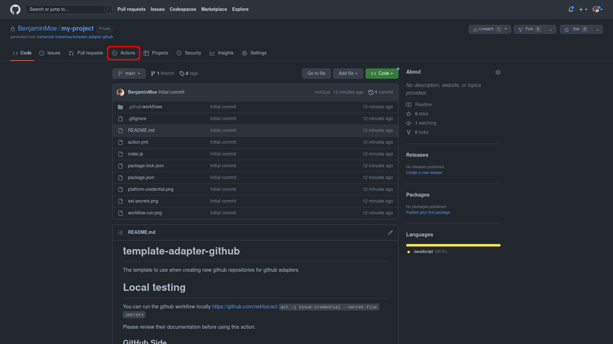
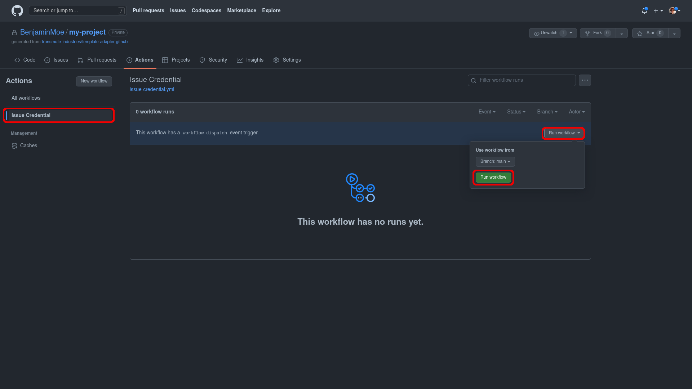
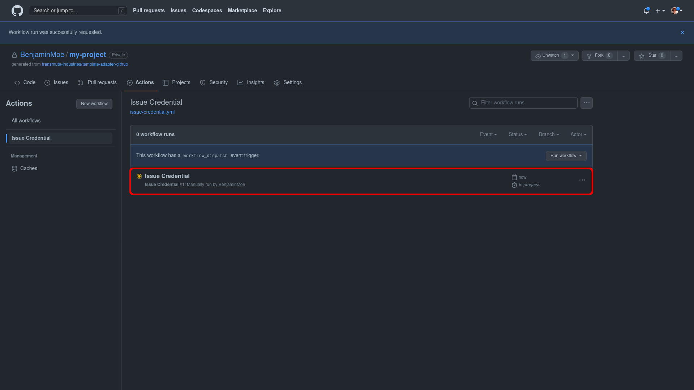
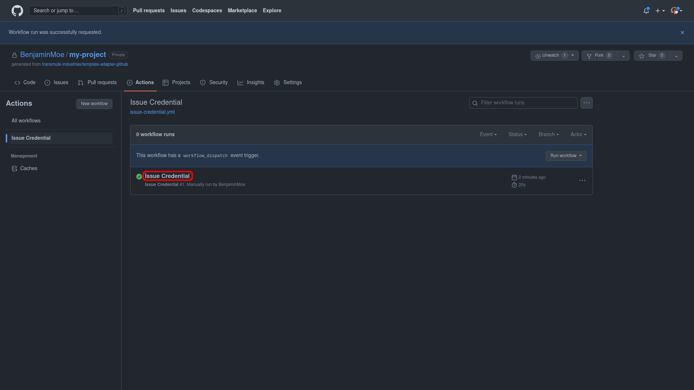
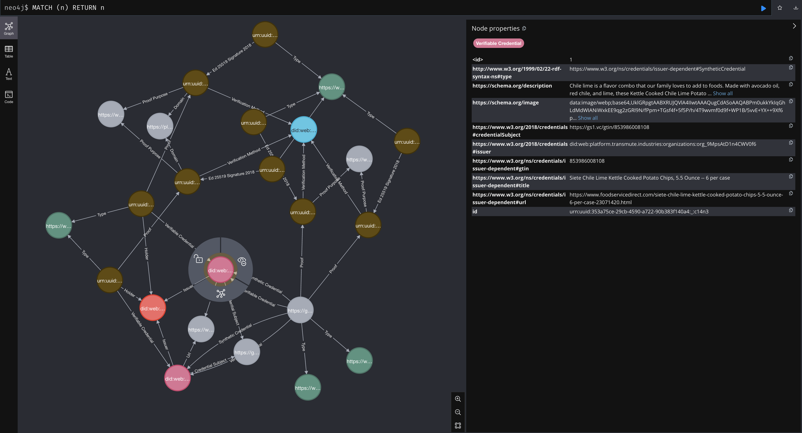

<p align="center">
  <a href="https://transmute.industries">
    
  </a>
</p>
<h1 align="center">
  Transmute Neo4j Adapter Action
</h1>

This repository provides boilerplate for synchronizign Verifiable Presentations in the Verifiable Data Platform to Noe4j with
Github workflows. You can find this and other adapters at https://platform.transmute.industries/marketplace/adapters.

## 🚀 Quick start

### Step 01

To run the action to synchronize verifiable presentations, click on the Actions tab on the top of the repository.



### Step 02

On the actions page, click on the Synchronize Presentations list item, then click the Run workflow dropdown. And click on the Run workflow button to trigger the action to issue the credential.



### Step 03

This will initialize a new action that will have a yellow spinning icon to indicate the workflow is running. Once the action is complete you should see the spinning yellow icon turn into a green check-mark.



### Step 04

Click on the Synchronize Presentations text to see the details about the action that was run.



You can check neo4j to see verifiable data graph representing your recent presentations.



## 💡 Learn more

- [Documentation](https://guide.transmute.industries/verifiable-data-platform/technical-documentation)

- [Guides](https://guide.transmute.industries/verifiable-data-platform/)

- [API Reference](https://platform.transmute.industries/openapi/openapi.yaml)


## Testing Locally:

```bash
act -j all-presentations --secret-file .env -P ubuntu-latest=catthehacker/ubuntu:act-latest
```

## 📘 Help and Support

[Transmute Support](https://transmute.atlassian.net/servicedesk/customer/portal/1)
